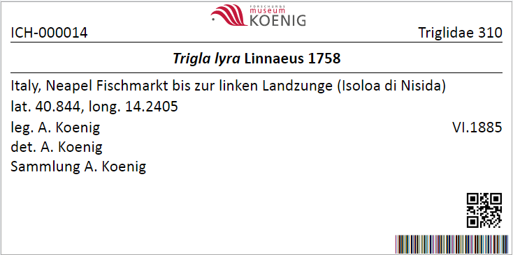
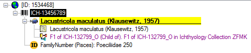
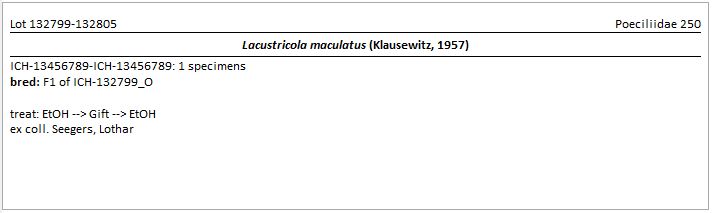

Label for Section Ichthyology
=============================

- Show content of **External Identifier** instead of Family in right upper corner (only for Type: `FamilyNumber (Pisces)`). Please note: the External Identifier must be attached to the organism, __not__ to the CollectionSpecimen!

Print QR code: to activate check the box "Print QR code on label" and choose "AccessionNumber" from the dropdown

Features:

- Group specimens by the presence of **Lot xxxx** in *LabelTitle*

- All other specimens are displayed as single labels

- Only one column of labels possible

- First and last catalogue number and number of specimens shown

If something is entered in the "Circumstances" field of the organism and the country is missing or caontins 'N/A', Circumstances is output instead of Event plus the content of any existing relation that is entered as a "Child of".

